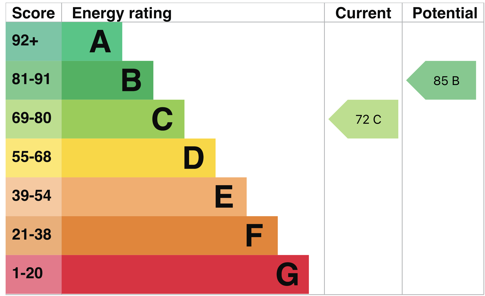

# Energy Performance Certificate Rating Vue Component

[](https://github.com/gemmadlou/vue-epc-component/actions/workflows/test.yml)

A little Vue.js component library to display the UK EPC Ratings.

## Usage

```vue
<script setup lang="ts">
import EPCRating from './components/EPCRating.vue';
</script>

<template>
  <EPCRating :current-score="72" :potential-score="85" />
</template>
```

## EPC Ratings

An Energy Performance Certificate (EPC) tells you how energy efficient a property is. Ratings are grated from A-G. The UK Gov website not only states the current energy rating, but the potential rating given recommendations are implemented.

You can find the energy rating for a property here: https://www.gov.uk/find-energy-certificate.



## Contributing

This project uses Vite + Vue 3 + TypeScript.

```bash
# Install dependencies
npm install

# Run development
npm run dev

# Run tests
npm test
```


- The project uses Vue 3 `<script setup>` SFCs, check out the [script setup docs](https://v3.vuejs.org/api/sfc-script-setup.html#sfc-script-setup) to learn more.

- Learn more about the recommended Project Setup and IDE Support in the [Vue Docs TypeScript Guide](https://vuejs.org/guide/typescript/overview.html#project-setup).

## Attributions

- This component [contains public sector information licensed under the Open Government Licence v3.0](https://www.nationalarchives.gov.uk/doc/open-government-licence/version/3/). The SVG provided is from the UK Gov website within minor alterations to work with Vue.js. Assets for all EPC related media can be found here: https://assets.publishing.service.gov.uk/media/5a748d20ed915d0e8bf19346/1790388.pdf. EPC ratings diagrams can be generated here: https://find-energy-certificate.service.gov.uk. 